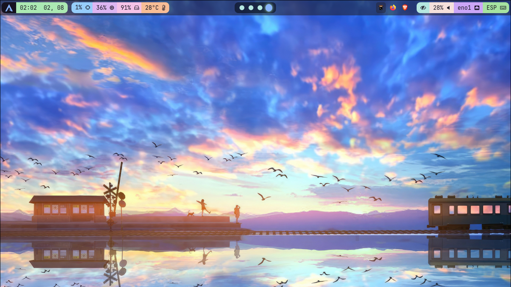

# WaybarTheme

🎨 Un tema personalizado para [Waybar](https://github.com/Alexays/Waybar) en entornos con Hyprland y otros window managers compatibles con barras de estado basadas en GTK y CSS.

---

## 📷 Capturas de pantalla

Imagen de referencia:


Pantalla completa:



---

## 🚀 Instalación

1. Clona este repositorio:
   ```bash
   git clone https://github.com/soaddevgit/WaybarTheme.git

2. Copia los archivos en tu carpeta de configuración:
   ```bash
   cp WaybarTheme/* ~/.config/waybar/

---

⚙️ Requisitos

🧭 Waybar

🔤 Fuentes NerdFonts (recomendado para una mejor visualización de íconos y glifos)

🖥️ Hyprland (o cualquier compositor compatible con Waybar)
    
    
---

📄 Licencia

📝 MIT License
Puedes usarlo, modificarlo y compartirlo libremente.

---

🙌 Créditos

Inspirado en otros temas de la comunidad de Wayland y personalizaciones:

🔗 [Configuración de Mohammad](https://github.com/mhdzli/dotfiles/tree/home/.config/waybar)

🔗 [Dotfiles de woioeow](https://github.com/woioeow/hyprland-dotfiles.git) :Style 1

🔗 [Waybar de Whiteshadow](https://github.com/elifouts/Dotfiles)

🔗 Wallpaper: [xtrafondos.com](https://www.xtrafondos.com/wallpaper/3840x2517/12224-paisaje-anime-arte-digital.html)

🤖 Y bastantes consultas a la IA.
